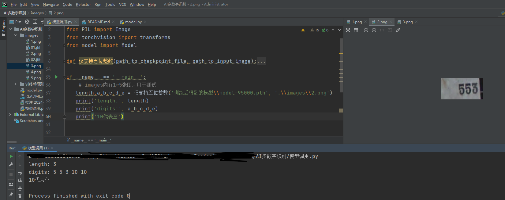
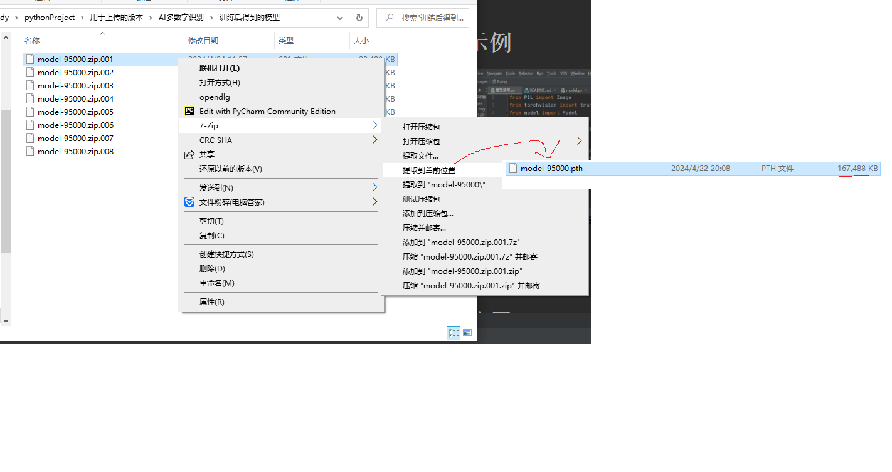

#更新时间2024.04.23
#1.前言
  训练这个的初衷是因为pyautogui截取游戏图片写游戏脚本时，不能获取图片的数字进行大招的释放。如果用多图片判断，
  会导致代码的判断逻辑冗长不好后期修改！本来想调用百度的AI数字识别，可是图片经过网络再返回，黄花菜都凉了。
  所以收集了很多的数据来训练这个模型。在本地部署，效果还是刚好能用的，对比SmartOcr来说。后期我看看这个模型在游戏脚
  本里面的表现，如果不如人意，我会继续想办法收集标记数据，或者找其他的模型算法解决这个问题。
  希望获得大家的支持。

#2.需要导入的包

     Python 3.6
     torch 1.10.2
     torchvision 0.11.3
#3.示例
 
解压成一个模型！
 

#4.使用

    `
       length,a,b,c,d,e = 仅支持五位整数('训练后得到的模型\model-95000.pth', '.\images\2.png')
       print('length:', length)
       print('digits:', a,b,c,d,e)
    `
#5.备注
    这个模型只支持5位整数的识别，但对于游戏内的数值够用。
    如果你觉得不够用，可以考虑把10位数字图片裁剪成分2张5位的。
    因为位数多少与训练的数据量有一定关系，训练用的数据量在几万张左右。(数据收集的活不好干！)
    项目对电脑性能有一定要求！
    项目对于使用者来说内容很少且非常好懂，所以我没写说明。
    有误差

# 6.捐赠 （如果项目有帮助到您，可以选择捐赠一些费用用于AI数字识别的后续版本维护，本项目长期维护）

[comment]: <> (![]&#40;images/01.jfif&#41; )

[comment]: <> (![]&#40;images/02.jfif&#41;)

 

